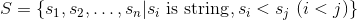
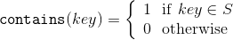

# B3研究室勉強会第７回「アルゴリズムとデータ構造 - 文字列集合の表現 -」課題

スライド
https://docs.google.com/presentation/d/1REM-hGZtoxLWP5adwsMmv0e860zDbqmR7kdCNZEAsEM/edit?usp=sharing

## 課題: 文字列集合を表現するデータ構造を作ってください
- 期限: 2020/1/10(fri)24:00
- 提出: 普段通り，自分の名前のディレクトリ内に全ファイルコピーしてください．
### 文字列集合


### 満たすべき機能


### やること
python のソースコードを用意しています．<br>
文字列集合を表現するデータ構造として`practice.py`の`StringSet`というクラスを用意しているので，**中身を実装してクラスを完成させてください**．

どんなデータ構造を使って実装しても構いません．
必要に応じて他のクラスや関数を書いて自由にコーディングしてください．

また，**あなたの実装をreport.mdで説明してください**(簡単でいいので)．
余裕があれば，計算量や記憶量を説明してください(なんとなくでもok)．

### 正しく実装できたかの確認
以下のpythonスクリプトを実行すると，あなたの`StringSet`が正しく実装されているかどうかを確認できます．
```python
python test.py
```

#### 文字列集合のテストセット
サンプル文字列集合として`s*.txt`を用意しています．<br>
`s*.txt`は辞書順昇順にソートされています．<br>
また，テスト用に対応した`t*.txt`を用意しています．<br>

以下のように引数を与えて実行すると，サンプル番号を指定してテストが出来ます
```python
python test.py 1
```

`s4.txt`は英語Wikipediaタイトル集合からランダムに抽出した10000個のキーです．


### 便利な機能
- 文字を整数として扱う
```python
ord('a')
>> 97
chr(97)
>> a
#int('a'), str(97)は変数を人間的に解釈する関数で，ぜんぜん違う処理
```
- 要素をn個持つ整数配列を作る
```python
arr = [0]*n
arr += [0]*n # arrに要素をn個追加
```
